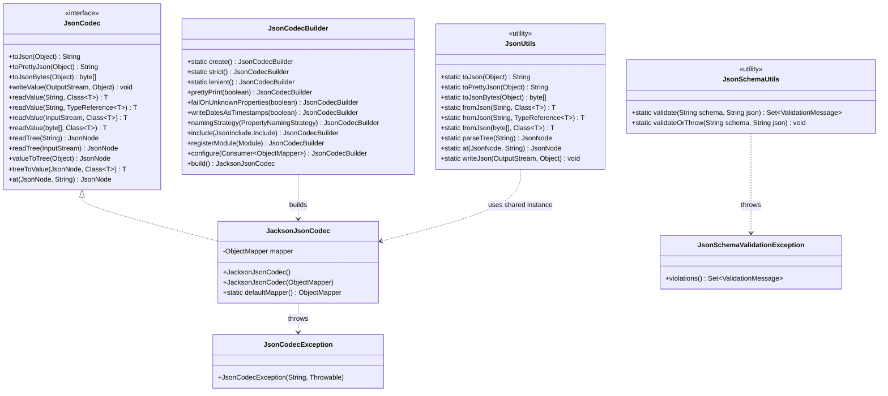

# ether-json

**Group ID:** `dev.rafex.ether.json`
**Artifact ID:** `ether-json`
**Packaging:** `jar`
**License:** MIT

`ether-json` is a lightweight, extensible JSON library for Java 21 built on top of Jackson. It wraps Jackson's `ObjectMapper` behind a clean `JsonCodec` interface, adds a fluent `JsonCodecBuilder` for customisation, provides static utility methods via `JsonUtils`, and optionally validates JSON documents against JSON Schema.

The goal is to give you a stable API you can depend on in your code — one that hides Jackson implementation details from your business logic, lets you swap or configure the codec without rippling through your codebase, and gives consistent, typed exceptions (`JsonCodecException`) everywhere serialisation or deserialisation fails.

---

## Table of Contents

1. [Maven dependency](#maven-dependency)
2. [Architecture overview](#architecture-overview)
3. [Quick start](#quick-start)
4. [Serialize and deserialize a Java record](#serialize-and-deserialize-a-java-record)
5. [Generic types with TypeReference](#generic-types-with-typereference)
6. [Working with streams and byte arrays](#working-with-streams-and-byte-arrays)
7. [Custom codec with JsonCodecBuilder](#custom-codec-with-jsoncodecbuilder)
8. [Tree model and JSON Pointer](#tree-model-and-json-pointer)
9. [JSON Schema validation](#json-schema-validation)
10. [Error handling](#error-handling)
11. [JsonUtils static methods](#jsonutils-static-methods)
12. [Using JsonCodec as an injectable interface](#using-jsoncodec-as-an-injectable-interface)

---

## Maven dependency

```xml
<dependency>
    <groupId>dev.rafex.ether.json</groupId>
    <artifactId>ether-json</artifactId>
    <version>8.0.0-SNAPSHOT</version>
</dependency>
```

If your project inherits from `ether-parent` or imports it as a BOM, omit the `<version>` tag.

---

## Architecture overview



---

## Quick start

The simplest entry point is `JsonUtils`, which uses a shared default `JacksonJsonCodec` instance:

```java
import dev.rafex.ether.json.JsonUtils;

record User(String name, int age) {}

// Serialize
String json = JsonUtils.toJson(new User("alice", 30));
// -> {"name":"alice","age":30}

// Deserialize
User user = JsonUtils.fromJson(json, User.class);
System.out.println(user.name()); // "alice"
```

For production code where you want explicit control over configuration and testability, use `JacksonJsonCodec` directly or obtain one from `JsonCodecBuilder`.

---

## Serialize and deserialize a Java record

Java 21 records work out-of-the-box with Jackson because their accessor methods follow Jackson's naming conventions.

```java
import dev.rafex.ether.json.JacksonJsonCodec;
import dev.rafex.ether.json.JsonCodec;

public record Product(
    String id,
    String name,
    double price,
    boolean inStock
) {}

public class ProductSerializer {

    private final JsonCodec codec = new JacksonJsonCodec();

    public String serialize(Product product) {
        return codec.toJson(product);
    }

    public Product deserialize(String json) {
        return codec.readValue(json, Product.class);
    }

    public String serializePretty(Product product) {
        return codec.toPrettyJson(product);
    }
}
```

Pretty-printed output:

```json
{
  "id" : "prod-001",
  "name" : "Mechanical Keyboard",
  "price" : 129.99,
  "inStock" : true
}
```

---

## Generic types with TypeReference

When the target type includes generic parameters (like `List<User>` or `Map<String, List<Order>>`), you must pass a `TypeReference` so Jackson retains the type information at runtime.

```java
import com.fasterxml.jackson.core.type.TypeReference;
import dev.rafex.ether.json.JacksonJsonCodec;
import dev.rafex.ether.json.JsonCodec;

import java.util.List;
import java.util.Map;

public record Order(String id, String product, int quantity) {}

JsonCodec codec = new JacksonJsonCodec();

// Deserialize a JSON array into List<Order>
String ordersJson = """
    [
        {"id":"o1","product":"keyboard","quantity":2},
        {"id":"o2","product":"mouse","quantity":1}
    ]
    """;

List<Order> orders = codec.readValue(
    ordersJson,
    new TypeReference<List<Order>>() {}
);

System.out.println(orders.size()); // 2
System.out.println(orders.get(0).product()); // "keyboard"

// Deserialize a nested generic map
String indexJson = """
    {
        "2024-01": [{"id":"o1","product":"keyboard","quantity":2}],
        "2024-02": [{"id":"o3","product":"monitor","quantity":1}]
    }
    """;

Map<String, List<Order>> byMonth = codec.readValue(
    indexJson,
    new TypeReference<Map<String, List<Order>>>() {}
);

System.out.println(byMonth.get("2024-01").get(0).product()); // "keyboard"
```

---

## Working with streams and byte arrays

```java
import dev.rafex.ether.json.JsonCodec;
import dev.rafex.ether.json.JacksonJsonCodec;
import com.fasterxml.jackson.core.type.TypeReference;

import java.io.InputStream;
import java.io.OutputStream;
import java.util.Map;

JsonCodec codec = new JacksonJsonCodec();

// Serialize to byte array (avoids String allocation — good for HTTP responses)
record ApiResponse(boolean success, String message) {}
byte[] bytes = codec.toJsonBytes(new ApiResponse(true, "OK"));

// Deserialize from byte array
ApiResponse response = codec.readValue(bytes, ApiResponse.class);

// Write directly to an OutputStream (zero-copy path to HTTP response)
void writeResponse(OutputStream out, ApiResponse resp) {
    codec.writeValue(out, resp);
}

// Read from InputStream (e.g., request body from Jetty handler)
ApiResponse readRequest(InputStream in) {
    return codec.readValue(in, ApiResponse.class);
}

// Generic type from InputStream
Map<String, Object> readGenericPayload(InputStream in) {
    return codec.readValue(in, new TypeReference<Map<String, Object>>() {});
}
```

---

## Custom codec with JsonCodecBuilder

`JsonCodecBuilder` provides a fluent API to configure `ObjectMapper` behavior and produce a `JacksonJsonCodec` instance. Each builder method returns `this` for chaining.

### Available presets

```java
import dev.rafex.ether.json.JsonCodecBuilder;
import dev.rafex.ether.json.JsonCodec;

// Strict: fails if JSON contains properties not in the target type
JsonCodec strict = JsonCodecBuilder.strict().build();

// Lenient: ignores unknown properties (default Jackson behavior)
JsonCodec lenient = JsonCodecBuilder.lenient().build();
```

### Full customisation example

```java
import com.fasterxml.jackson.annotation.JsonInclude;
import com.fasterxml.jackson.databind.PropertyNamingStrategies;
import com.fasterxml.jackson.datatype.jsr310.JavaTimeModule;
import dev.rafex.ether.json.JsonCodecBuilder;
import dev.rafex.ether.json.JsonCodec;

JsonCodec apiCodec = JsonCodecBuilder.create()
    // Produce human-readable output with indentation
    .prettyPrint(true)
    // Use snake_case for JSON keys: myField -> my_field
    .namingStrategy(PropertyNamingStrategies.SNAKE_CASE)
    // Omit null values from serialized output
    .include(JsonInclude.Include.NON_NULL)
    // Write java.time types as ISO-8601 strings, not epoch timestamps
    .writeDatesAsTimestamps(false)
    // Register the JavaTimeModule for java.time support
    .registerModule(new JavaTimeModule())
    // Fail if JSON has properties not declared in the record
    .failOnUnknownProperties(true)
    .build();

record Event(String name, java.time.Instant occurredAt, String description) {}

var event = new Event("user.created", java.time.Instant.now(), null);
System.out.println(apiCodec.toJson(event));
// {"name":"user.created","occurred_at":"2026-03-19T12:00:00Z"}
// Note: description is null and therefore omitted
```

### Low-level escape hatch

If you need access to a specific `ObjectMapper` feature that is not exposed by `JsonCodecBuilder`, use the `configure` method:

```java
import com.fasterxml.jackson.databind.SerializationFeature;

JsonCodec codec = JsonCodecBuilder.create()
    .configure(mapper -> {
        mapper.enable(SerializationFeature.ORDER_MAP_ENTRIES_BY_KEYS);
    })
    .build();
```

---

## Tree model and JSON Pointer

`JsonNode` is Jackson's generic tree model. Use it when you need to inspect or transform JSON without mapping it to a specific type.

```java
import com.fasterxml.jackson.databind.JsonNode;
import dev.rafex.ether.json.JsonCodec;
import dev.rafex.ether.json.JacksonJsonCodec;

JsonCodec codec = new JacksonJsonCodec();

String json = """
    {
        "user": {
            "id": "u-42",
            "profile": {
                "name": "Alice",
                "email": "alice@example.com"
            },
            "roles": ["admin", "editor"]
        }
    }
    """;

// Parse into a tree
JsonNode root = codec.readTree(json);

// Navigate with JSON Pointer (RFC 6901)
JsonNode name  = codec.at(root, "/user/profile/name");
JsonNode first = codec.at(root, "/user/roles/0");

System.out.println(name.asText());  // "Alice"
System.out.println(first.asText()); // "admin"

// Convert a node back to a typed value
record Profile(String name, String email) {}
Profile profile = codec.treeToValue(
    root.at("/user/profile"),
    Profile.class
);
System.out.println(profile.email()); // "alice@example.com"

// Convert any object to a JsonNode tree
record Dimensions(int width, int height) {}
JsonNode dimNode = codec.valueToTree(new Dimensions(1920, 1080));
System.out.println(dimNode.get("width").asInt()); // 1920
```

---

## JSON Schema validation

`JsonSchemaUtils` uses the `networknt/json-schema-validator` library (already pulled in as a dependency of `ether-json`) to validate a JSON string against a JSON Schema draft.

### Validate without throwing

```java
import com.networknt.schema.ValidationMessage;
import dev.rafex.ether.json.JsonSchemaUtils;

import java.util.Set;

String schema = """
    {
        "$schema": "https://json-schema.org/draft/2020-12/schema",
        "type": "object",
        "required": ["name", "email"],
        "properties": {
            "name":  {"type": "string", "minLength": 1},
            "email": {"type": "string", "format": "email"},
            "age":   {"type": "integer", "minimum": 0}
        },
        "additionalProperties": false
    }
    """;

String valid   = """{"name": "Alice", "email": "alice@example.com", "age": 30}""";
String invalid = """{"name": "", "email": "not-an-email"}""";

Set<ValidationMessage> errors = JsonSchemaUtils.validate(schema, invalid);
errors.forEach(e -> System.err.println(e.getMessage()));
// -> $.name: must be at least 1 characters long
// -> $.email: must be a valid email address
```

### Validate and throw on failure

```java
import dev.rafex.ether.json.JsonSchemaUtils;
import dev.rafex.ether.json.JsonSchemaValidationException;

try {
    JsonSchemaUtils.validateOrThrow(schema, invalid);
} catch (JsonSchemaValidationException e) {
    // Access the full set of violation messages
    e.violations().forEach(v -> System.err.println(v.getMessage()));
}
```

### Use schema validation at an HTTP handler boundary

```java
public class CreateUserHandler {

    private static final String USER_SCHEMA = """
        {
            "$schema": "https://json-schema.org/draft/2020-12/schema",
            "type": "object",
            "required": ["username", "email"],
            "properties": {
                "username": {"type": "string", "minLength": 3},
                "email":    {"type": "string", "format": "email"}
            }
        }
        """;

    private final JsonCodec codec = new JacksonJsonCodec();

    public void handle(InputStream requestBody, OutputStream responseBody) {
        var rawJson = new String(codec.toJsonBytes(
            codec.readValue(requestBody, Object.class)));
        try {
            JsonSchemaUtils.validateOrThrow(USER_SCHEMA, rawJson);
        } catch (JsonSchemaValidationException e) {
            // Return 400 Bad Request
            codec.writeValue(responseBody,
                new ErrorResponse("Validation failed", e.violations().stream()
                    .map(v -> v.getMessage()).toList()));
            return;
        }
        // Proceed with business logic
    }

    record ErrorResponse(String message, java.util.List<String> errors) {}
}
```

---

## Error handling

All serialisation and deserialisation errors thrown by `JacksonJsonCodec` are wrapped in `JsonCodecException`, which extends `RuntimeException`. You do not need to declare it in `throws` clauses.

```java
import dev.rafex.ether.json.JsonCodecException;
import dev.rafex.ether.json.JsonUtils;

record User(String name, int age) {}

// Parse failure — malformed JSON
try {
    User user = JsonUtils.fromJson("{broken", User.class);
} catch (JsonCodecException e) {
    System.err.println("JSON parse error: " + e.getMessage());
    // e.getCause() holds the original Jackson exception
}

// Serialization failure — e.g. custom serializer throws
try {
    String json = JsonUtils.toJson(someUnserializableObject);
} catch (JsonCodecException e) {
    System.err.println("Serialization error: " + e.getMessage());
}
```

---

## JsonUtils static methods

`JsonUtils` wraps a shared, lazily initialised `JacksonJsonCodec` for cases where you do not need per-operation codec configuration. It is thread-safe.

| Method signature | Description |
|---|---|
| `toJson(Object)` | Serialise to compact JSON string |
| `toPrettyJson(Object)` | Serialise to indented JSON string |
| `toJsonBytes(Object)` | Serialise to `byte[]` |
| `writeJson(OutputStream, Object)` | Write JSON to an output stream |
| `fromJson(String, Class<T>)` | Deserialise from string |
| `fromJson(String, TypeReference<T>)` | Deserialise with generic type |
| `fromJson(byte[], Class<T>)` | Deserialise from bytes |
| `fromJson(InputStream, Class<T>)` | Deserialise from stream |
| `parseTree(String)` | Parse into `JsonNode` tree |
| `at(JsonNode, String)` | Navigate tree with JSON Pointer |

---

## Using JsonCodec as an injectable interface

Because `JsonCodec` is an interface, you can inject it and swap implementations in tests without touching your business logic.

```java
// In production code — depend on the interface, not the implementation
public class OrderService {

    private final JsonCodec codec;

    public OrderService(JsonCodec codec) {
        this.codec = codec;
    }

    public String exportOrder(Order order) {
        return codec.toPrettyJson(order);
    }
}

// In production wiring
JsonCodec codec = JsonCodecBuilder.create()
    .writeDatesAsTimestamps(false)
    .registerModule(new JavaTimeModule())
    .build();

var service = new OrderService(codec);

// In tests — use a default codec or a mock
var testService = new OrderService(new JacksonJsonCodec());
```

With Google Guice or another DI framework, bind it in a module:

```java
public class JsonModule extends AbstractModule {
    @Override
    protected void configure() {
        bind(JsonCodec.class).toInstance(
            JsonCodecBuilder.create()
                .writeDatesAsTimestamps(false)
                .registerModule(new JavaTimeModule())
                .build()
        );
    }
}
```
